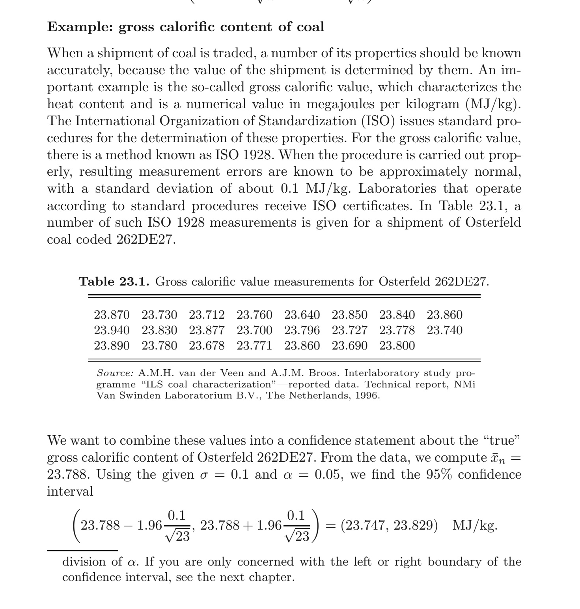
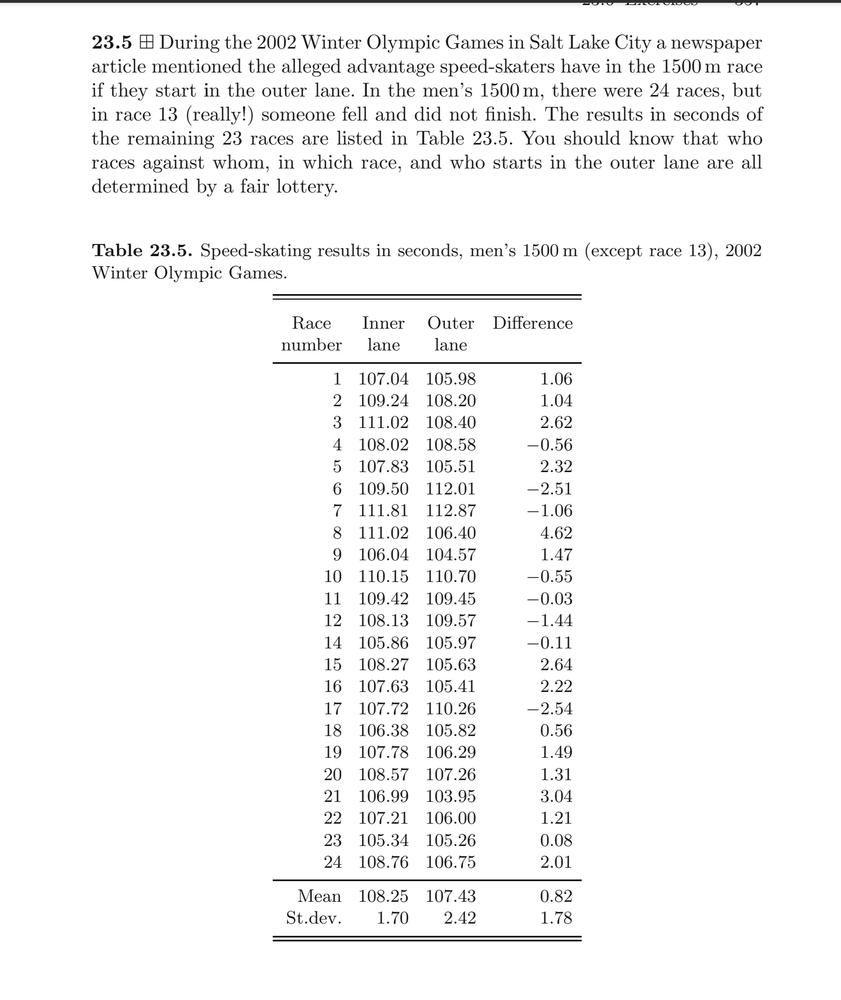

---
title: 'Confidence Intervals for the Mean: Known vs Unknown Standard Deviation'
author: "Levi Lopes de Lima"
date: "`r Sys.Date()`"
output:
  html_document: default
  pdf_document: default
link-citations: true
bibliography: prob_notes.bib
---


```{r setup, include=FALSE}
knitr::opts_chunk$set(echo = TRUE)
```

#### Explaning the lab

In this lab we construct two types of confidence intervals for the mean of a normal population:

1. A z-interval assuming the population standard deviation is **known**.
2. A t-interval assuming the population standard deviation is **unknown**.

In order to make the codes reusable, we wrap them in certain R functions depending on the relevant parameters (``ci_mean_known_sigma`` and ``ci_mean_unknown_sigma_2``), which are then applied to a couple of problems appearing in [@dekking2005modern], to which we refer for the theoretical details; see also [@delima2025probab] for further discussions on the subject.

####  A glimpse at the theory I

Recall that a random variable $X$ is said to follow a normal (notation: $X\sim\mathcal N(\mu,\sigma^2)$, where $\mu\in\mathbb R$ and $\sigma^2>0$) if it is continuous (in the sense that its distribution $P_X$ is absolutely continuous with respect to Lebesgue measure: $dP_X=\psi_Xdx$) and its **probability density function** $\psi_X=\psi_{(\mu,\sigma^2)}$ is given by 
\[
\psi_{(\mu,\sigma^2)}(x)=\frac{1}{\sqrt{2\pi}\sigma}e^{-\frac{(x-\mu)^2}{2\sigma^2}}, \quad x\in\mathbb R.
\]
We recall that $\mathbb E(X)=\mu$ and ${\rm var}(X)=\sigma^2$ so the shape of $\psi_{(\mu,\sigma^2)}$, as member of this family of densities, is completely determined by these population parameters. 

We will be interested in estimating the population mean $\mu$ starting from a random sample $\{X_j\}_{j=1}^{+\infty}$ drawn from a normal population as above. As usual, we take the **sample mean**, 
\[
\overline X_n=\frac{X_1+\cdots+X_n}{n},
\]
as the corresponding estimator, and will make use of the **pivotal method**,
which in this case relies on the following well-known fact:

  - If, for $j=1,\dots,k$, $Y_j\sim\mathcal N(\mu_j,\sigma_j^2)$ are independent, $a_j\in\mathbb R$ and $b\in \mathbb R$ then 
 \[
 \sum_ja_jY_j+b\sim\mathcal N\left(\sum_ja_j\mu_j+b,\sum_ja_j^2\sigma_j^2\right). 
 \]
 
In words, any affine combination of independent normal random variables follows a normal with the anticipated expectation and variance. 

Using this we easily check that that the **standardization**
\[
\overline Z_n=\frac{\overline X_n-\mu}{\sigma/\sqrt{n}}
\]
of $\overline X_n$
is a **pivotal quantity** in the sense that its distribution does *not* depend on the estimated parameter $\mu$, as it follows a standard normal:
\[
\overline Z_n\sim \mathcal N(0,1).
\]
Hence, for any $0<\alpha<1$ there holds
\[
P\left(-z_{\alpha/2}\leq \overline Z_n\leq z_{\alpha/2} \right)=1-\alpha,
\]
where
\[
z_{\alpha/2}=\Phi^{-1}\left(1-\frac{\alpha}{2}\right), \quad \Phi(x)=\int_{-\infty}^x\psi_{(0,1)}(t)dt
\]
is the **normal quantile** associated to the **confidence level** $1-\alpha$.
Of course, we may rewrite this as a confidence interval (CI) for $\mu$:
\[
\mu\in\left[\overline X_n\mp z_{\alpha/2}\frac{\sigma}{\sqrt{n}}\right]\,\,\,\textrm{with prob.}=1-\alpha.
\]
We insist that this **z-interval** is an exact (not approximate) CI which holds true for samples of any size $n$, its only drawback being that its length (twice the margin of error) depends on the (generally unknown!) standard deviation $\sigma$.


#### The first problem (as taken from [@dekking2005modern], page 347)



Since $\sigma=0.1$ is known, we may implement the theoretical formula for the the z-interval above to check the computation in the end of the example. 


#### Reading the data (coal)

After extracting the data set in the table above to a csv file...

```{r}
dados <- read.csv("coal.csv")
```

...we may view its structure...

```{r}
str(dados)
```

...and then print it for comparison:

```{r}
print(dados)
```

It is convenient to store the data set as a vector for further use:

```{r}
x <- dados$measurement
length(x)
summary(x)
```


#### A z-interval for the coal dataset (known $\sigma$)

As already remarked, the code will be wrapped in a R function with three parameters: the data set vector ``x``, the (known) standard deviation ($\sigma$) and $\alpha=1-\textrm{confidence level}$. 

```{r}
#building a function for computing a z-interval (known sigma)
ci_mean_known_sigma <- function(x, sigma, alpha = 0.05) {
  # sample size and mean
  n     <- length(x)
  meanx <- mean(x)
  # standard error under known sigma
  se <- sigma / sqrt(n)
  # normal critical value
  zcrit <- qnorm(1 - alpha/2)
  # margin of error
  margin <- zcrit * se
  # interval endpoints
  lower <- meanx - margin
  upper <- meanx + margin
  # return as a list
  return(list(
    n        = n,
    mean     = meanx,
    se       = se,
    z_crit   = zcrit,
    lower    = lower,
    upper    = upper
  ))
}
```

We now save the lists generated by the evaluation of the function ``ci_mean_known_sigma`` at $\sigma=0.1$ with three choices for the confidence level: 92%, 95% and 98%.

```{r}
# saving the evaluated function
ci_known_coal_90 <- ci_mean_known_sigma(x,0.1,0.1) # 90%
ci_known_coal <- ci_mean_known_sigma(x,0.1,0.05) # 95% (the standard choice)
ci_known_coal_98 <- ci_mean_known_sigma(x,0.1,0.02) # 98%
str(ci_known_coal)
```

The result may be displayed in a table (with half of the items in the lists omitted for convenience):

```{r}
ci_table_coal <- data.frame(
  Method        = c("z-interval (known sigma at 90%)","z-interval (known sigma at 95%)","z-interval (known sigma at 98%)"),
 # SD_or_sigma   = round(c(sigma_known, sd_hat), 4),
  #SE            = round(c(se_known, se_hat), 4),
  #CriticalValue = round(c(z_crit, t_crit), 4),
  CI_Lower      = round(c(ci_known_coal_90$lower,ci_known_coal$lower,ci_known_coal_98$lower), 4),
  Mean          = round(c(ci_known_coal_90$mean,ci_known_coal$mean,ci_known_coal_98$mean), 4),
  CI_Upper      = round(c(ci_known_coal_90$upper,ci_known_coal$upper,ci_known_coal_98$upper), 4)
)
knitr::kable(ci_table_coal, caption = "Confidence Interval for the Coal Problem (known sigma)")
```


As expected, the CIs get larger with the confidence level. Also, the result for 95% matches the computation in the example above. 


#### The problem of the races (taken from [@dekking2005modern], page 357)

We now turn to another (proposed) problem in [@dekking2005modern].



We quote from the original source: 

  - As a consequence of the lottery and the fact that many different factors
contribute to the actual time difference “inner lane minus outer lane” the
assumption of a normal distribution for the difference is warranted. The
numbers in the last column can be seen as realizations from an $\mathcal N(\mu,\sigma^2)$. distribution, where $\mu$ is the expected outer lane advantage. *Construct a
95% confidence interval for* $\mu$. N.B. $n = 23$, not $24$!

We remark that the assumption that the sample follows a normal is justified by the "Hypothesis of Elementary Errors"; see [@fischer2011history], Chapter 3.


#### A glimpse at the theory II

Since now the standard deviation $\sigma$ is unknown, one must somehow estimate it. From the Law of Large Numbers and the fundamental identity
\[
\sum_j(X_j-\mu)^2=\sum_j(X_j-\overline X_n)^2+n(\overline X_n-\mu)^2
\]
we easily check that the **sample variance**
\[
S_n^2=\frac{1}{n-1}\sum_j(X_j-\overline X_n)^2
\]
satisfies:

  - $\mathbb E(S^2_n)=\sigma^2$ (which means that $S^2_n$ is **unbiased** for $\sigma^2$);
  
  - $S^2_n\stackrel{p}{\to}\sigma^2$ (which means that $S^2_n$ is **consistent** for $\sigma^2$).

In particular, $S_n\stackrel{p}{\to}\sigma$  and $S_n$ is **consistent** for the standard deviation $\sigma$. It follows  that the **studentization**
\[
T_{n-1}:=\frac{\overline X_n-\mu}{S_n/\sqrt{n}},
\]
which is obtained from the padronization $\overline Z_n$ of $\overline X_n$ by the replacement $\sigma\rightsquigarrow S_n$, satisfies
\[
T_{n-1}=\frac{\sigma}{S_n}\overline Z_n\stackrel{d}{\to}\mathcal N(0,1),
\]

which immediately yields an approximate **large sample** CI for $\mu$:
\[
\mu\in\left[\overline X_n\mp z_{\alpha/2}\frac{S_n}{\sqrt{n}}\right]\,\,\,\textrm{with prob.}\approx 1-\alpha,
\]
but of course this does **not** apply to the problem at hand (because a sample with $n=23$ fails to qualify as being large!). Taking into account that 
\[
T_{n-1}=\frac{\frac{\overline X_n-\mu}{\sigma/\sqrt{n}}}{\sqrt{\frac{\frac{n-1}{\sigma^2}S_n^2}{n-1}}},
\]
the explicit determination of the distribution of $T_{n-1}$ depends on the following facts (both relying heavily on the assumption that the underlying population is normal):

 - $\frac{\overline X_n-\mu}{\sigma/\sqrt{n}}\sim\mathcal N(0,1)$;
 - $\frac{n-1}{\sigma^2}S_n^2\sim\chi^2_{n-1}$, the **chi-square** distribution of $n-1$ degrees of freedom.
 
The key step now is to combine this with a fundamental result due to W. S. Gosset: 

 - For any $k\geq 1$, if $Z\sim\mathcal N(0,1)$ and $W\sim\chi^2_k$ are independent then 
 \[
 T_k:=\frac{Z}{\sqrt{W/k}}=t_kdx,
 \]
 where
 \[
 t_k(x)=\frac{\Gamma(\frac{k+1}{2})}{\sqrt{\pi k}\Gamma(\frac{k}{2})}\left(1+k^{-1}x^2\right)^{-\frac{k+1}{2}}.
\]
In words, $T_k$ follows a **Student distribution** with $k$
degrees of freedom[^1]. 

[^1]: The name "Student" is a pseudonym used by William Sealy Gosset, a noted British statistician, in his scientific paper publications during his work at the Guinness Brewery in Dublin, Ireland.

Leading this to the above expression for $T_{n-1}$, we immediately obtain a CI for $\mu$ which applies to the cases in which $\sigma$ is unknown:

\[
\mu\in\left[\overline X_n\mp t_{n-1,\alpha/2}\frac{S_n}{\sqrt{n}}\right]\,\,\,\textrm{with prob.}= 1-\alpha,
\]
where $t_{n-1,\alpha/2}$ is the **Student quantile** associated to the confidence level $1-\alpha$. Note that this **t-interval** is not only exact but also applies to samples of **any** size. As we shall see below, it applies to the "races problem" displayed above. 
 


#### Reading the data (races)

As usual, we start by reading the data from a csv file...

```{r}
dados_2 <- read.csv("races.csv")
str(dados_2)
head(dados_2)

```

...and saving the results in the last column (``difference``) as a vector for further use:

```{r}

y <- dados_2$difference
length(y)
summary(y)
```


#### A t-interval for the races data set (unknown $\sigma$)

We now proceed to the code, as always wrapped in a function depending on only two (adjustable) parameters, the data set vector ``y`` and $\alpha=1-\textrm{confidence level}$, as here $\sigma$ is unknown and should be estimated from data (the line ``sd_hat_2 <- sd(y)`` in the code):

```{r}
#building a function for computing a t-interval
ci_mean_unknown_sigma_2 <- function(y, alpha = 0.05) {
  # sample size and mean
  m     <- length(y)
  meany <- mean(y)
  # sample standard deviation
  sd_hat_2 <- sd(y)
  # standard error
  se_2 <- sd_hat_2 / sqrt(m)
  # Student t critical value
  tcrit <- qt(1 - alpha/2, df = m - 1)
  # margin of error
  margin <- tcrit * se_2
  # interval endpoints
  lower <- meany - margin
  upper <- meany + margin
  # return as a list
  return(list(
    m        = m,
    mean     = meany,
    sd_hat   = sd_hat_2,
    se       = se_2,
    t_crit   = tcrit,
    lower    = lower,
    upper    = upper
  ))
}
```

We now evaluate the function at two confidence levels, save the resulting lists as vectors...

```{r}
#saving the evaluated function
ci_unknown_2_95 <- ci_mean_unknown_sigma_2(y,0.05) # 95% (the standard choice)
ci_unknown_2_98 <- ci_mean_unknown_sigma_2(y,0.02) # 98%
```

...which are then displayed in a table:

```{r}
ci_table_skates <- data.frame(
  Method        = c("t-interval for races (unknown sigma at 95%)", "t-interval for races (unknown sigma at 98%)"),
 SD_or_sigma   = round(c(ci_unknown_2_95$sd_hat,ci_unknown_2_98$sd_hat), 4),
  #SE            = round(c(se_known, se_hat), 4),
  #CriticalValue = round(c(z_crit, t_crit), 4),
  CI_Lower      = round(c(ci_unknown_2_95$lower,ci_unknown_2_98$lower), 4),
 Mean          = round(c(ci_unknown_2_95$mean,ci_unknown_2_98$mean), 4),
  CI_Upper      = round(c(ci_unknown_2_95$upper,ci_unknown_2_98$upper), 4)
)
knitr::kable(ci_table_skates, caption = "Confidence Interval for races (unknown sigma)")
```

Since the t-interval in the first row fails to enclose $0$, we may argue that, at the 95% confidence level, the speed skaters in the outer lanes appear to have a real advantage. Note, however, that according to the t-interval in the second row, this statistical evidence disappears at the 98% confidence level since the CI now contains $0$, a possible value for the population $\mu$. Thus, we may obtain seemingly conflicting results depending on the chosen confidence level, but there is no contradiction here, since this choice is inherently subjective.


#### A final comparison

Here we pretend that the estimated value for the standard deviation $\sigma\approx 1.78$ (appearing in the first column above) is the true population value $\sigma$ and use it to compute the corresponding z-interval by means of the function ``ci_mean_known_sigma()`` previously constructed.

```{r}
ci_est<-ci_mean_known_sigma(y,1.78,0.05)
print(ci_est)
```

... so we may now compare the intervals (both at a 95% level of confidence)...

```{r}
ci_table_comp <- data.frame(
  Method        = c("t-interval (unknown sigma)",
                    "z-interval (estimated sigma)"),
 # SD_or_sigma   = round(c(ci_unknown_2$sd_hat, ci_est$sd_hat), 4),
  #SE            = round(c(ci_unknown_2$se, ci_est$se_hat), 4),
  #CriticalValue = round(c(z_crit, t_crit), 4),
  CI_Lower      = round(c(ci_unknown_2_95$lower, ci_est$lower), 4),
  Mean          = round(c(ci_unknown_2_95$mean, ci_est$mean), 4),
  CI_Upper      = round(c(ci_unknown_2_95$upper, ci_est$upper), 4)
)

knitr::kable(ci_table_comp, caption = "Comparison of Confidence Intervals for races (unknown and estimated sigma)")
```

... to check that the z-interval is a bit smaller. This simply confirms that the Student t-distribution has heavier tails than the normal distribution, which implies  $t_{n-1,\alpha/2}>z_{\alpha/2}$ for any choice of $\alpha$. Since $t_{n-1,\alpha/2}\to z_{\alpha/2}$ as $n\to+\infty$, the distinction between the two intervals becomes negligible for large sample sizes; it is only for relatively small $n$ (such as $n=23$) that the difference becomes appreciable.

#### References

